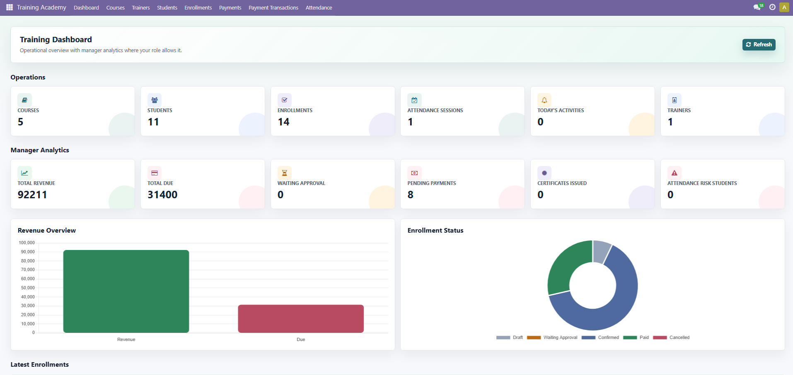

# Training Academy Management System

An Odoo 17 custom module for managing training courses, trainers, students, enrollments, attendance, payments, certificates, portal access, and website course enrollment.

## Features

- Course management with trainer assignment, fees, discounts, available seats, and course status.
- Trainer and student records with smart buttons for related courses and enrollments.
- Enrollment approval workflow from draft to waiting approval, confirmed, paid, or cancelled.
- Attendance tracking with attendance percentage calculation.
- Payment management with receipt numbers, payment history, and due amount calculation.
- Online payment transaction support.
- Certificate generation after full payment and attendance eligibility.
- QWeb PDF reports for courses, enrollments, payments, and certificates.
- Website course listing, course detail page, and public enrollment form.
- Portal page for students to view enrollments, pay dues, and download certificates.
- Email notifications for enrollment submission, approval, payment confirmation, attendance warning, and certificate generation.
- Backend dashboard assets for training KPIs.

## Module Information

| Item | Value |
| --- | --- |
| Odoo version | 17.0 |
| Module technical name | `Training_academy_management_system` |
| License | LGPL-3 |
| Main path | `custom_addons/Training_academy_management_system` |

## Dependencies

This module depends on:

- `base`
- `web`
- `mail`
- `website`
- `portal`

## Installation

1. Copy the module into your Odoo custom addons directory:

```bash
custom_addons/Training_academy_management_system
```

2. Make sure your Odoo configuration includes the custom addons path:

```ini
addons_path = addons,custom_addons
```

3. Restart the Odoo server.

4. Update the app list from Odoo:

```text
Apps > Update Apps List
```

5. Search for **Training Academy** and install the module.

You can also update the module from the command line:

```bash
python odoo-bin -c odoo.conf -d your_database_name -u Training_academy_management_system
```

## Main Workflow

1. Create a trainer.
2. Create a course and assign the trainer.
3. Confirm the course.
4. Create or receive a student enrollment.
5. Submit the enrollment for approval.
6. A training manager approves the enrollment.
7. Add payment records until the full course fee is paid.
8. Record attendance for the student.
9. Mark the enrollment as paid when payment and attendance rules are satisfied.
10. Generate and print the certificate.

## Certificate Flow

Certificates are generated from the `training.enrollment` model.

When an enrollment is marked as paid:

- The enrollment state changes to `paid`.
- `completion_date` is set to the current date.
- `certificate_number` is generated from the `training.certificate` sequence.
- A certificate email notification can be sent to the student.
- The **Print Certificate** button becomes available.

The certificate PDF is rendered by:

- Report action: `reports/certificate_report.xml`
- QWeb template: `reports/certificate_template.xml`
- Sequence: `data/certificate_sequence.xml`

The portal certificate download URL uses the same report template:

```text
/report/pdf/Training_academy_management_system.report_training_certificate/<enrollment_id>
```

## Reports

The module includes these QWeb PDF reports:

| Report | Model | Template |
| --- | --- | --- |
| Course Report | `training.course` | `report_training_course_template` |
| Enrollment Receipt | `training.enrollment` | `report_training_enrollment_template` |
| Payment Receipt | `training.payment` | `report_training_payment_template` |
| Training Certificate | `training.enrollment` | `report_training_certificate` |

## Website And Portal Pages

Public website routes:

- `/training/courses`
- `/training/course/<course_id>`
- `/training/course/<course_id>/enroll`

Portal routes:

- `/my/training`
- `/my/training/enrollment/<enrollment_id>`

## Screenshots

Add your screenshots inside:

```text
docs/screenshots/
```

Recommended screenshot names:

| Page | Screenshot path |
| --- | --- |
| Dashboard | `docs/screenshots/dashboard.png` |
| Courses | `docs/screenshots/courses.png` |
| Course Form | `docs/screenshots/course-form.png` |
| Trainers | `docs/screenshots/trainers.png` |
| Students | `docs/screenshots/students.png` |
| Enrollments | `docs/screenshots/enrollments.png` |
| Enrollment Form | `docs/screenshots/enrollment-form.png` |
| Attendance | `docs/screenshots/attendance.png` |
| Payments | `docs/screenshots/payments.png` |
| Certificate PDF | `docs/screenshots/certificate.png` |
| Website Courses | `docs/screenshots/website-courses.png` |
| Website Enrollment | `docs/screenshots/website-enrollment.png` |
| Student Portal | `docs/screenshots/student-portal.png` |

Example:

```markdown

```

## Project Structure

```text
Training_academy_management_system/
├── controllers/
├── data/
├── models/
├── reports/
├── security/
├── static/
├── views/
├── __init__.py
├── __manifest__.py
└── README.md
```

## Important Models

| Model | Purpose |
| --- | --- |
| `training.course` | Course records, fees, seats, trainer assignment, and course state |
| `training.trainer` | Trainer profile and related courses |
| `training.student` | Student profile and related enrollments |
| `training.enrollment` | Enrollment workflow, payment totals, attendance percentage, and certificate fields |
| `training.payment` | Manual payment receipts and payment status |
| `training.payment.transaction` | Online payment transaction records |
| `training.attendance` | Attendance session tracking |

## Security

Access rights and security groups are defined in:

- `security/training_security.xml`
- `security/ir.model.access.csv`

Training managers can approve enrollments and manage training records according to the configured security rules.

## Notes

- Certificate generation requires full payment.
- Manual **Mark Paid** requires at least 80% attendance.
- The certificate PDF is generated dynamically from the enrollment record.
- If you change XML reports, update the module to reload report templates.
